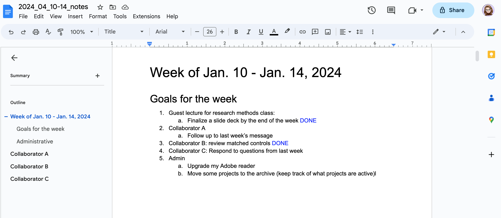
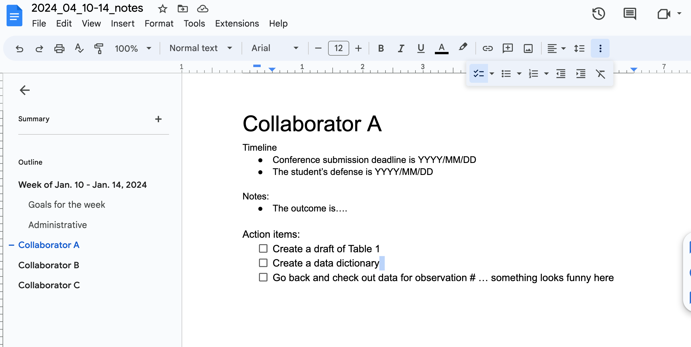

# Getting organized: The first 3 days of a new RA job

The first step in starting out as a research assistant is establishing habits of organization. American author O. S. Marden said it this way: "A good system shortens the road to the goal." You will be more productive and produce higher quality work -- work that is reproducible and rigorous -- if you begin by establishing an organizational system. 

I will outline here both general principles and some specific strategies that have proven helpful for my work. These points are organized according to the three major components to your work system that should be established within your first few days on the job: 

1. File structure 

2. Emails 

3. Notes and README files 

## File structure

'File structure' refers to the system for categorizing your code, notes, reports, and figures for each project. Here are some general principles: 

1. One master folder per project 

  - the 'master folder' structure translates well to starting GitHub repositories [CROSS REF]. 

2. Subfolders for each file type 

  - keeping subfolders by file type will help you find what you are looking for. Also, doing it this way will let you script your work from the command line with ease -- for example, you can apply a function or use an executable file to work with all the items in a given folder.
  
  
3. Names that are readable for both humans and machines

  - use names that can be easily ordered by a computer; again, this helps with writing scripts. 
  - avoid using white spaces, as this is a hassle for machines to read. Choose to work with either 'CamelCase' or 'snake_case', and be consistent. 
  - use specific keywords in file names: 'tkp_edited_version' is better than 'final_version'
  - it's worth saying again: choose a convention and be consistent
  - one more time for the folks in the back: choose a convention and **be consistent**. 
  - for a brief (and entertaining) tutorial on naming things, checkout [Jenny Bryan's YouTube video](https://www.youtube.com/watch?v=ES1LTlnpLMk). 
  
  
  
4. Example 

Here is a step-by-step example of how I use a file structure to organize myself at the start of a new project (if you'd prefer, [skip to the video](#folder-video)). Suppose I am contacted by Collaborator A for support on a study of a new endodontic treatment...

  1. I begin by creating a new folder with a name that fits my established convention. For my new project, I would create a folder `TKP23-A-Endo`. My folders are stored in a shared drive to which other biostatistician have access, so I begin my folder names with my initials (TKP). the '23' tells me that the project started in 2023. The 'A' and 'Endo' keywords tell me who is the PI/what project it is (this is helpful since it is not uncommon for me to have multiple projects from the same lab). 
  
  2. The first file I add to my new `TKP23-A-Endo` folder is a [README file](#readme). This includes notes from the initial meeting/first email from Collaborator A.
  
  3. I open [RStudio](https://posit.co/download/rstudio-desktop/) and go to `File > New Project`. I follow the prompts to create a new project, and the directory (a.k.a the folder) in which this project will live is my new `TKP23-A-Endo` folder. Using an R project is an example of a broader principle of [project-oriented workflow](https://www.tidyverse.org/blog/2017/12/workflow-vs-script/). 
  
  4. I go to my `TKP23-A-Endo` folder (which now has two things in it: a `.Rproj` file and a `README` file), and I make 4 subfolders: `data`, `scripts`, `reference`, and `reports`. These are the building blocks of my projects. 
  
    - I will get data from Collaborator A, and it will go in the data folder. **Nothing else** will go in the data folder, and I will never change any files in the data folder.   
    
    - `scripts` will be the place where I put all of the code I use for data cleaning and analysis. 
    
    - `reference` is where I will put things Collaborator A shares with me that help me understand the research question -- this could be articles in endodontics that provide an explanation of the terminology, or a PowerPoint that explains how the data are collected. I would also keep a copy of the [IRB](https://www.fda.gov/regulatory-information/search-fda-guidance-documents/institutional-review-boards-frequently-asked-questions) documentation in this `reference` folder.  
    
    - `reports` is where I will keep my final `.Rmd` file for writing the report which I will share with Collaborator A. 
    
From here, I begin writing scripts. 
    
    
  5. As the project moves along, I may find that I need other subfolders. For instance, a `graphics` subfolder would be useful if I am making a ton of plots for a project. If I am writing a manuscript and there's quite a bit of back-and-forth with reviewers, I would use a `submission` subfolder that contains all my point-to-point responses (CROSS REF) for reviewers. 
  
  
### Folder setup video {#folder-video}  

[Here's a short YouTube video](https://youtu.be/4UxoLIOmkzc) that gives an overview of my typical project folder setup.  

### Please use relative file paths 

Computers work with files by having a 'pointer' at a specific folder, called a *directory*. Your computer probably has many directories on it -- for example, 'Desktop' and 'Downloads' are both directories you have by default in a Mac operating system. When you are doing project-based quantitative work, your scripts (the files with the code in them) will need to 'point' to data that is probably in another place. Instead of copying data into multiple folders, or using functions like `setwd()`, use *relative filepaths*. This can be accomplished using the `..` symbol to reference a *parent directory*. [Here is a short video](https://youtu.be/eb11iggmuwM) on how I use relative file paths. 

## Emails

Email management is of paramount importance for collaboration. Emails serve 2 purposes: 

  - Providing a paper trail to document important exchanges of information 
  
  - Facilitating conversations that can happen in an asynchronous way 

I have found the [Inbox Zero method](https://hive.com/blog/inbox-zero/) for email management to be a helpful place to begin. This method breaks down emails in to 4 categories: delete, delegate, defer, and do. Practically speaking, I have folders named for each person with whom I correspond. When I receive a new email that needs an answer, this goes in a 'needs follow up' folder. After following up, I move the conversation to the folder with the appropriate name (with group conversations categorized by the PI). 

I **do not recommend** using emails to exchange versions of important files. Several tools exist to facilitate collaboration in a more efficient way - Microsoft offers 'OneDrive', Google offers 'GoogleDrive', and of course, there's [GitHub](https://docs.github.com/en/get-started/getting-started-with-git). In addition, most organizations have a some kind of shared drive/shared repository. As often as possible, use shared resources for file sharing as opposed to emailing different versions. 
  
  
### Organizing your inbox 

Here's a short video on how to organize your inbox: 

TODO: add video here! 

## Project notes and README files {#project-notes}

You have to keep track of what you are learning. In addition, you need to keep a log of what you have done so that other collaborators/future RAs can look back and figure out what you did. Let's call these two tasks *internal* documentation (keeping track of your project-specific work) and *external* documentation (the project-specific notes you want to leave for others). I recommend writing project notes for internal documentation, and README files for external documentation. 

### Project notes

Each project is a process that unfolds over time. As you learn over the course of a project, you'll need some kind of time-organized system for keeping track of your thoughts and action items. Using Google Drive, I have created a system of weekly project notes to serve this purpose. The setup looks like this: 

Each week (typically on Monday morning), I create a new Google doc file named `YYYY_MM_DD1-DD2_notes` (YYYY = year, MM = month, DD1-2 = dates of Monday & Friday). On the first page, I set goals for the week. I check off things that are completed by marking them as done. Colored fonts help me stay organized, especially in seasons where I have several collaborative projects going on concomitantly. I often use blue text to show things that are done, and red text to show deadlines. 

At the left panel, you can see that each subsequent page of my document is given a subheading link with the collaborator's name. To navigate to my notes for each collaborator, I can use these subheading links to quickly find what I am looking for. If I click on Collaborator A, I would see this page: 

My notes for each project are typically sorted into times/deadlines, notes, and action items. Whereas my weekly goals are different each week, I probably won't address all the action items for each project in a given week. The notes on this "Collaborator A" page may are updated only as often I am working on this project/in contact with the collaborator. 

At the start of the next week, I begin my copying the notes from the previous week (the whole file) and then updating the weekly goals. This is an iterative process, where the 'current' value becomes the 'old' value in the next iteration. 

This system of file keeping has allowed me to focus my goals for each week, to measure the progress I am making, and to reference projects that resurface after a long break (which is typical). No one else has access to these notes except me, and I write them in 'shorthand' (using acronyms, etc.) knowing that these notes are just for my personal reference. 

Notice that these notes are both 1) linear (chronological) and 2) project-specific. These features differentiate project notes from [building a personal knowledge base](#zettelkasten). Personally, I have found it helpful to keep these two types of notes distinct. My project notes have lots of deadlines, dates, and to-do items -- I don't want these things to get mixed up into my personal knowledge base notes.  

### README files {#readme}

Each project on which I collaborate has a README file, which has the details that a future analyst would need to jump into a project mid-story. Typically, my README files contain: 

  - The names of the PI/collaborators 
  
  - The objective/scientific aim of the project 
  
  - The definitions of any project-specific acronyms 
  
  - Any notes on data analysis decisions (i.e., dichotomizing a continuous variable, etc.). Often, these notes are lines from an important email that I copy & paste into the README. This keeps a coherent record of the decision points in a project timeline. 

For a deeper dive on writing README files, check out [this tutorial article](https://www.freecodecamp.org/news/how-to-write-a-good-readme-file/).
