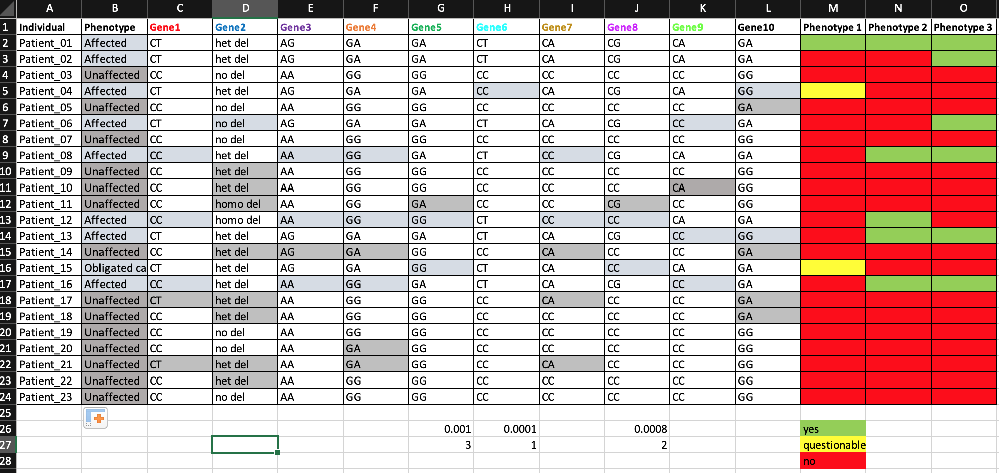

# Data processing and preparation 

One of the most challenging aspects of a project can be preparing the data for analysis. In real life, our data seldom looks like something from `mtcars`: 


```{r}
knitr::kable(
  head(mtcars[, 1:8], 10),
  booktabs = TRUE,
  caption = 'Canonical example of clean data'
)
```


Instead, I often receive data that looks like this: 




Instead of Google searching how to handle each step of processing data like this, this chapter will offer a step-by-step outline of the whole game. I will show you what packages and strategies I used to prepare these data for analysis in R. 

Aside: when I need to process raw data, I like to begin by sketching the data frame I want to build. Big fan of the white board for tasks like this. 

## Libraries 
After a sketch, I start with choosing some tools for working with color-coded Excel data. Beside each library I load, I'll comment the reason I find it useful:

```{r, message=FALSE}
# for data processing 
library(readxl) # read in .xlsx documents 
library(dplyr) # transform & clean data (with 'pivot_' functions)
library(tidyr) # transform & clean data 
library(tidyxl) # read in .xlsx *formatting*, including color codes

# for visualization 
library(ggplot2) # drawing plots 
library(knitr) # creating tables (has 'kable()' function)
library(kableExtra) # making tables pretty 
library(viridis) # choose color palettes
```


## Reading in the data 

Here, I read in the data multiple ways to obtain different information. The first line creates `raw`, which reads in the data without any formatting information. This will make the phenotype columns have all `NA` values. I need the other `raw_` objects to get that information into a workable form. 

```{r}
raw <- read_excel(path = "data/unprocessed_data_example.xlsx")
raw_cells <- xlsx_cells(path = "data/unprocessed_data_example.xlsx") 
raw_formats <- xlsx_formats(path = "data/unprocessed_data_example.xlsx") # has color codes 
raw_id <- raw_cells[raw_cells$col == 1, c("address", "row", "col", "character")]
```

## Work with color codes 

Next, I need to fill in the phenotype information that is color-coded. The colors will be included in `raw_formats` as [HEX codes](https://www.makeuseof.com/hex-code-what-is-it/) (without the leading hashtag). 

```{r}
colors <- raw_formats$local$fill$patternFill$fgColor$rgb
# NB: colors are given here in order of appearance on the sheet (reading top to bottom)

```

To help me work with the color codes, I wrote a function called `cells_by_color`. **As soon as you catch yourself being tempted to copy and paste a chunk of code several times, it is time to write a function!**. This is the *most important message* of the tutorial. Data cleaning is a place where there is no room to be sloppy. 

```{r}
#' a function to return the cells of a given color 
#' @param formats An object returned from tidyxl::xlsx_formats
#' @param cells An object returned from tidyxl::xlsx_cells
#' @param color The hex color WITHOUT the leading "#" mark
#' @return a tibble with the addresses of the cells in that color 
#' 
cells_by_color <- function(formats, cells, color){
  colors <- formats$local$fill$patternFill$fgColor$rgb
  
  cells[cells$local_format_id %in% which(colors == color), 
                      c("address", "row", "col")]
  
}
```

Now, to see my function in action: 

```{r}
# NB: column M in raw data = phenotypeotype 1
# column N in raw data = phenotypeotype 2
# column O in raw data = phenotypeotype 3

green <- cells_by_color(formats = raw_formats,
                        cells = raw_cells,
                        color = "FF92D050") |> 
  mutate(phenotype = case_when(
    substr(address, 1, 1) == "M" ~ "phenotype1",
    substr(address, 1, 1) == "N" ~ "phenotype2",
    substr(address, 1, 1) == "O" ~ "phenotype3"
  ),
  color = "green")

red <- cells_by_color(formats = raw_formats,
                      cells = raw_cells,
                      color = "FFFF0000") |>
  mutate(phenotype = case_when(
    substr(address, 1, 1) == "M" ~ "phenotype1",
    substr(address, 1, 1) == "N" ~ "phenotype2",
    substr(address, 1, 1) == "O" ~ "phenotype3"
  ),
  color = "red")


yellow <- cells_by_color(formats = raw_formats,
                         cells = raw_cells,
                         color = "FFFFFF00") |> 
  mutate(phenotype = case_when(
    substr(address, 1, 1) == "M" ~ "phenotype1",
    substr(address, 1, 1) == "N" ~ "phenotype2",
    substr(address, 1, 1) == "O" ~ "phenotype3"
  ),
  color = "yellow")


```

With the color codes labeled, I am ready to create a data frame with both genotype and phenotype information: 

(As of 2023/06/19, this chapter is still in progress... will add more below). 

```{r}
phen1 <- bind_rows(
  red |> filter(phenotype == "phenotype1"),
  green |> filter(phenotype == "phenotype1"),
  yellow |> filter(phenotype == "phenotype1")
) |> 
  mutate(phen1 = case_when(
    color == "green" ~ 1,
    color == "red" ~ 0,
    color == "yellow" ~ 0.5
  )) |> 
  right_join(raw_id, by = "row") |> 
  select(c("character", "phen1")) |> 
  # drop cells with no data (left over from header row)
  drop_na(phen1) 


phen2 <- bind_rows(
  red |> filter(phenotype == "phenotype2"),
  green |> filter(phenotype == "phenotype2")
) |> 
  mutate(phen2 = case_when(
    color == "green" ~ 1,
    color == "red" ~ 0
  )) |> 
  right_join(raw_id, by = "row") |> 
  select(c("character", "phen2")) |> 
  # drop cells with no data (left over from header row)
  drop_na(phen2) 


phen3 <- bind_rows(
  red |> filter(phenotype == "phenotype3"),
  green |> filter(phenotype == "phenotype3")
) |> 
  mutate(phen3 = case_when(
    color == "green" ~ 1,
    color == "red" ~ 0
  )) |> 
  right_join(raw_id, by = "row") |> 
  select(c("character", "phen3")) |> 
  # drop cells with no data (left over from header row)
  drop_na(phen3) 

```

## Final steps

I will write one more function to help me with the last step: 

```{r}
#' a function to retrieve the Nth value in an strsplit() list 
#' @param x The character to split 
#' @param split The split 
#' @param which The numeric value indicating which item to retrieve
split_which <- function(x, split, which){
  split_x <- strsplit(x, split) |> lapply(function(l){l[which]})
  return(unlist(split_x))
}
```


Finally, I have: 

```{r}
phen <- full_join(phen1, phen2) |> 
  full_join(phen3) |> 
  rename(individual = character) |> 
  filter(individual != "Individual") |> 
  # need numeric ID for pedigreemm functions 
  mutate(id = split_which(individual, "_", 2)) 


wide <- left_join(phen, raw,
                  by = c("individual" = "Individual")) |> 
  # analysis decision: make the obligated carrier unaffected, as per discussion 
  #   with clinicians
  mutate(phenotype = if_else(Phenotype == "Obligated carrier (unaffected?)",
                             "Unaffected",
                             Phenotype),
         id = as.numeric(id)) |> 
  select(individual, id, phenotype, starts_with('Gene'), paste0("phen", 1:3)) |> 
  arrange(id)

# snapshot of final data
knitr::kable(wide[,c(1:6,14:16)],
       booktabs = TRUE,
       caption = 'Final product - ready to analyze/graph')
```


```{r, include=FALSE, eval=FALSE}
# TODO: see if Petrin lab will approve of me sharing the OAV data, in any form
# Pending their approval, I could link this to my PLMM article!

## Bonus: PLINK files

# To analyze this kind of genetic data, you may choose to use [PLIINK](https://www.cog-genomics.org/plink/1.9/) software. Here is an example of making a PLINK file (this can be generalized to other kinds of files): 

ped <- ped_raw |> 
  transmute(FID = rep(1, nrow(wide)),
         IID = individual,
         FATHER = if_else(is.na(father), 0, father),
         MOTHER = if_else(is.na(mother), 0, mother),
         SEX = sex)  |>  
  left_join(wide, join_by(IID == id)) |> 
  mutate(PHEN = if_else(phenotype == "Unaffected", 1, 2),
         # make A1 = minor allele
         Gene1_A1 = split_which(Gene1, "", 2),
         Gene1_A2 = split_which(Gene1, "", 1),
         Gene3_A1 = split_which(Gene3, "", 2),
         Gene3_A2 = split_which(Gene3, "", 1),
         Gene4_A1 = split_which(Gene4, "", 2),
         Gene4_A2 = split_which(Gene4, "", 1),
         Gene5_A1 = split_which(Gene5, "", 2),
         Gene5_A2 = split_which(Gene5, "", 1),
         Gene6_A1 = split_which(Gene6, "", 2),
         Gene6_A2 = split_which(Gene6, "", 1),
         Gene7_A1 = split_which(Gene7, "", 2),
         Gene7_A2 = split_which(Gene7, "", 1),
         Gene8_A1 = split_which(Gene8, "", 2),
         Gene8_A2 = split_which(Gene8, "", 1),
         Gene9_A1 = split_which(Gene9, "", 2),
         Gene9_A2 = split_which(Gene9, "", 1),
         Gene10_A1 = split_which(Gene10, "", 2),
         Gene10_A2 = split_which(Gene10, "", 1)
  ) |> 
  select(FID:SEX, PHEN, starts_with('Gene'))
  
# write out the file 
write.table(ped,
            file = "data/example.ped",
            sep = "\t",
            quote = FALSE,
            row.names = FALSE,
            col.names = FALSE)

```

